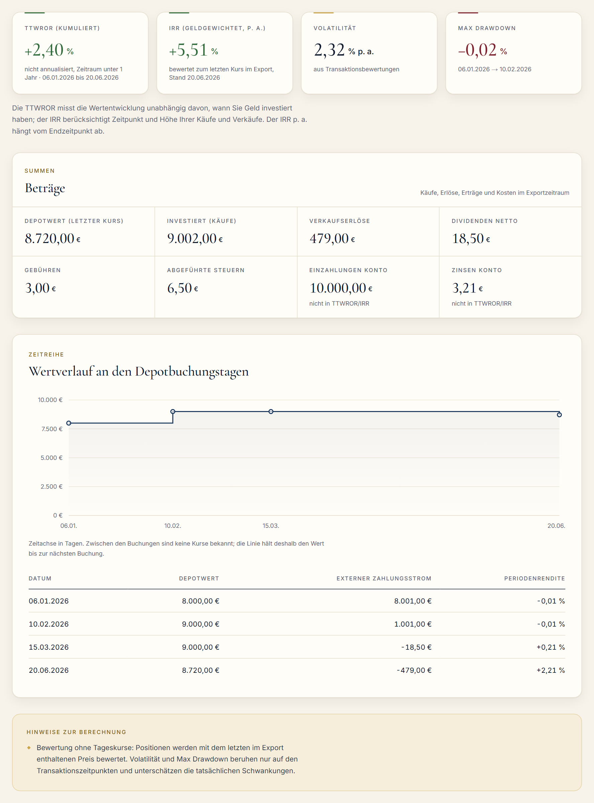
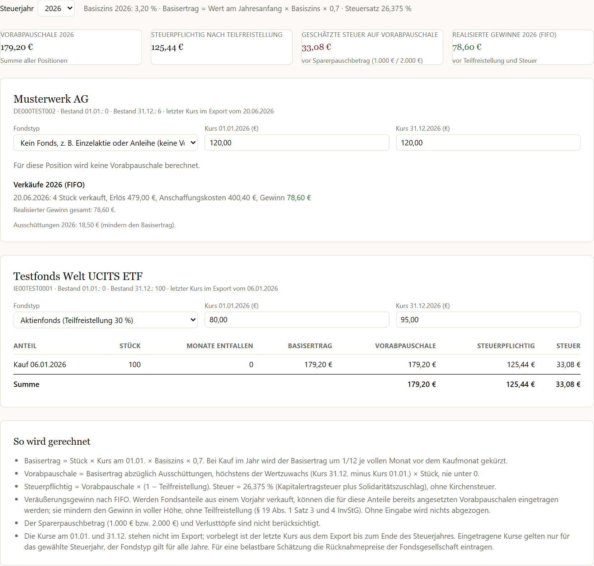

# DepotDoktor

Clientseitiger Depot-Steuer- und Performance-Analyzer für deutsche Broker-Exporte. CSV rein, Report raus. Keine Anmeldung, kein Server, keine Datenübertragung.

[](https://github.com/mirkan-morgenfels-ai/AI-Project-1/actions/workflows/ci.yml)
[](./LICENSE)

Live-Demo: https://ai-project-1-web.vercel.app/projects/depotdoktor

**English summary.** DepotDoktor is a browser-only portfolio analyzer for German brokerage CSV exports (Trade Republic and Scalable Capital, more planned). It computes the time-weighted return (TTWROR), the money-weighted return (IRR via Newton's method), volatility, maximum drawdown and asset allocation, and it estimates German fund taxation (Vorabpauschale, Teilfreistellung, FIFO). All computation runs client-side; no data leaves the browser. Built with Next.js and TypeScript, tested with Vitest and Playwright.

## Problem

Deutsche Broker liefern keine verständliche, exportierbare Aufstellung, die die zeitgewichtete Rendite und den internen Zinsfuß sauber trennt und die Fondsbesteuerung (Vorabpauschale, Teilfreistellung) nachrechnet. Gratis-Tracker bieten keinen deutschen Steuerreport, Bezahl-Tracker kosten ab rund 12 € im Monat, Desktop-Software hat eine steile Lernkurve. DepotDoktor schließt diese Lücke mit einem Werkzeug, das im Browser rechnet und kostenlos bleibt.

## Was DepotDoktor macht

- Liest den Transaktionsexport von Trade Republic und die Transaktionen-CSV von Scalable Capital ein und erkennt das Format an der Kopfzeile.
- Berechnet TTWROR, IRR, Volatilität (annualisiert) und Max Drawdown aus den Transaktionen.
- Zeigt die Allokation nach Assetklasse und Region.
- Schätzt die Vorabpauschale je Position nach § 18 InvStG mit Teilfreistellung, Zwölftelung bei unterjährigem Kauf und FIFO bei Verkäufen.
- Exportiert den Report als PDF und die normalisierten Transaktionen als CSV.
- Verarbeitet alles im Browser. Es gibt keinen Upload, keinen Account und keinen Speicher. Eine Content-Security-Policy mit `connect-src 'self' data:` verhindert technisch, dass die Seite Daten an fremde Server sendet.

## Screenshots





Beide Ansichten zeigen die synthetische Trade-Republic-Testdatei aus `packages/csv/fixtures/`.

## So funktioniert es

```
CSV-Datei (Browser)
  -> Papa Parse
  -> Broker-Erkennung (Header-Signatur)
  -> Normalisierung (Datum, Dezimaltrenner, Vorzeichen, Encoding)
  -> Transaktionsmodell (Buy / Sell / Dividend / Fee / Tax)
  -> Rechenmodul (TTWROR, IRR, Volatilitaet, MDD, Allokation, Steuer)
  -> Report-Ansicht (Recharts) + Export (@react-pdf/renderer, CSV)
```

## Unterstützte Exporte

| Anbieter | Status | Format |
|---|---|---|
| Trade Republic (Transaktionsexport aus der App) | unterstützt | 23 Spalten, Komma, alle Felder in Anführungszeichen, Dezimalpunkt, ISO-Datum, UTF-8 |
| Scalable Capital (Broker → Transaktionen → CSV) | unterstützt | 14 Spalten, Semikolon, Dezimalkomma, ISO-Datum, UTF-8 |
| DKB, ING, comdirect (Depot-Exporte) | geplant | Formate werden an echten Dateien verifiziert |
| Trade Republic PDF-Abrechnungen | geplant | Fallback für ältere Zeiträume |

Testdateien für jeden unterstützten Anbieter liegen unter `packages/csv/fixtures/`. Sie sind synthetisch und enthalten keine echten Daten.

## Kennzahlen und Steuerlogik

- TTWROR: Verkettung der Periodenrenditen zwischen den Cashflows, sodass Ein- und Auszahlungen die Rendite nicht verzerren.
- IRR: Nullstelle des Kapitalwerts per Newton-Verfahren, mit Bisektion als Fallback bei mehreren Vorzeichenwechseln.
- Volatilität: Standardabweichung der Periodenrenditen zwischen den Buchungstagen, auf Tagesbasis normiert und annualisiert mit √252. Ohne Tageskurse unterschätzt sie die tatsächliche Schwankung; die Oberfläche weist darauf hin.
- Max Drawdown: größter Rückgang vom laufenden Höchststand des zeitgewichteten Index. Nach einem Vollverkauf läuft der Index weiter; Zeiten ohne Bestand zählen mit 0 %, sodass ein Neukauf keinen künstlichen Rückgang erzeugt.
- Vorabpauschale: Basisertrag = Fondswert am Jahresanfang × Basiszins × 0,7, gedeckelt auf den tatsächlichen Wertzuwachs, abzüglich Ausschüttungen, nie negativ. Basiszins 2026: 3,20 % (BMF-Schreiben vom 13.01.2026), 2025: 2,53 %. Teilfreistellung 30 % (Aktienfonds), 15 % (Mischfonds), 60 % bzw. 80 % (Immobilienfonds). Steuersatz 26,375 % (25 % Kapitalertragsteuer plus Solidaritätszuschlag). Kirchensteuer, Sparerpauschbetrag (1.000 € bzw. 2.000 €) und Verlusttöpfe sind in v1 nicht berücksichtigt; die Oberfläche sagt das.
- FIFO: Bei Verkäufen gelten die zuerst gekauften Anteile als zuerst verkauft. Werden Fondsanteile aus einem Vorjahr verkauft, kann im Steuerreiter der Betrag der bereits angesetzten Vorabpauschalen eingetragen werden; er mindert den Veräußerungsgewinn in voller Höhe (§ 19 Abs. 1 Satz 3 und 4 InvStG). Ohne Eingabe wird nichts abgezogen.

Rechenbeispiel: 10.000 € in einem thesaurierenden Aktien-ETF am 1. Januar 2026, Wertzuwachs 1.500 € im Jahr. Basisertrag 224,00 €, nach Teilfreistellung 156,80 € steuerpflichtig, Steuer 41,36 €.

Der Fondstyp (und damit die Teilfreistellungsquote) wird je Position vom Nutzer gewählt und gilt für alle Steuerjahre; Standard ist Aktienfonds. Eine freie, weiterverbreitbare Datenquelle für die Teilfreistellungsquote je ISIN gibt es nicht. Die Kurse am 01.01. und 31.12. werden dagegen je Steuerjahr und Position eingetragen; vorbelegt ist jeweils der letzte Kurs aus dem Export bis zum Ende dieses Jahres. Beim Wechsel des Steuerjahres erscheinen die Kurse des gewählten Jahres, und der PDF-Report verwendet sie.

## Datenschutz

Die CSV-Datei wird ausschließlich im Browser gelesen und verarbeitet. Es findet keine Übertragung an einen Server statt, es gibt keine Anmeldung und keinen Speicher. Der Netzwerk-Tab des Browsers zeigt nach dem Laden der Seite keine weiteren Anfragen; ein automatisierter Test prüft das bei jedem Pull Request. Es läuft keine Seitenstatistik.

## Tech-Stack

Next.js 15 (App Router), TypeScript (strict), Tailwind CSS, Papa Parse, Recharts, @react-pdf/renderer, decimal.js für Geldbeträge, Vitest, Playwright, pnpm Workspaces, GitHub Actions, Vercel.

## Lokale Ausführung

Voraussetzungen: Node.js 20 oder neuer, pnpm 9 oder neuer.

```bash
git clone https://github.com/mirkan-morgenfels-ai/AI-Project-1.git
cd AI-Project-1
pnpm install
pnpm --filter web dev
```

Danach ist die Seite unter http://localhost:3000/projects/depotdoktor erreichbar. Umgebungsvariablen sind nicht nötig.

## Tests

```bash
pnpm test
pnpm test:e2e
```

`pnpm test` führt die Unit-Tests in `packages/csv`, `packages/pdf` und `apps/web` aus. `pnpm test:e2e` startet den Dev-Server (mit `CI=true` und `E2E_SERVER=start` nach `pnpm build` den Produktionsserver, wie in der CI) und lädt die Testdateien im Browser; ohne installierte Playwright-Browser kann ein vorhandenes Chromium über `PLAYWRIGHT_CHROMIUM_PATH=/pfad/zu/chromium` angegeben werden.

Stand 07.10.2026: 168 Unit-Tests und 11 Playwright-Tests, alle grün; dazu ein bewusst offener Test (`todo`) für Fall D, siehe `docs/verifikation.md`.

Unit-Tests decken TTWROR, IRR (einschließlich Divergenz-Fallback), Volatilität, Max Drawdown (auch nach Vollverkauf), Vorabpauschale (Normalfall, Wertzuwachs unter Basisertrag, Verlustjahr, unterjähriger Kauf), FIFO mit angesetzten Vorabpauschalen, Kurseingaben je Steuerjahr mit Fondstyp je Position, die Dateityp-Erkennung (PDF, ZIP, Binärdaten, Windows-1252, UTF-16 mit BOM), den CSV-Export und den PDF-Report (Textextraktion: Steuertabelle und Disclaimer auf jeder Seite) ab, jeweils mit von Hand gerechneten Erwartungswerten. Die E2E-Tests laden die Testdateien beider Broker hoch, auch als UTF-16-Datei, prüfen Kennzahlen und Diagramme in allen Reitern, die Eingabe angesetzter Vorabpauschalen beim Verkauf, den Wechsel des Steuerjahres mit Kursen je Jahr, den PDF- und CSV-Download, die Fehlermeldung bei unbekanntem Format, die Ablehnung von PDF- und Excel-Dateien, die Links der Startseite, die Aussagen zum Quellcode auf Startseite und Rechtsseiten und dass während der Auswertung keine Anfrage die Seite verlässt.

Die Steuerlogik ist gegen die durchgerechneten Fälle A bis E des Umsetzungsdokuments getestet. Die Prüfung gegen den Vorabpauschale-Rechner der Stiftung Warentest und ein Finanztip-Beispiel steht noch aus; offene Punkte und Abweichungen sind in `docs/verifikation.md` dokumentiert.

Die CI führt bei jedem Push und Pull Request `install → typecheck → lint → test → build` aus und anschließend die Playwright-Tests gegen den gebauten Stand.

## Projektstruktur

```
apps/web/app/projects/depotdoktor/    Seite
apps/web/components/depotdoktor/      Upload, Reiter Performance, Allokation, Steuer, Transaktionen
apps/web/lib/depotdoktor/             Bewertung, Kennzahlen (metrics/), Steuerlogik (tax/)
apps/web/lib/depotdoktor/__tests__/   Unit-Tests mit Handrechnungen
apps/web/e2e/                         Playwright-Tests
packages/csv/                         Parser, Broker-Erkennung, Normalisierung, Fixtures
packages/ui/                          Basiskomponenten
packages/legal/                       Disclaimer, Datenschutztexte
packages/charts/                      Diagramm-Komponenten (Recharts)
packages/pdf/                         Report-Vorlage für den PDF-Export (@react-pdf/renderer)
docs/verifikation.md                  Prüfstand der Steuerlogik, offene Punkte, Abweichungen
```

## Grenzen

- Keine Live-Kurse. Offene Positionen werden mit dem letzten Preis aus dem Export bewertet.
- Der Fondstyp wird manuell gewählt; eine falsche Wahl ergibt eine falsche Teilfreistellung.
- Steuerergebnisse sind Schätzungen. Maßgeblich ist die Abrechnung der depotführenden Bank, die zusätzlich Freistellungsaufträge, Verlusttöpfe und Kirchensteuer berücksichtigt.
- Ändert ein Broker sein Exportformat, bricht der Parser mit einer Fehlermeldung ab, statt falsche Zahlen zu liefern.
- Nur CSV-Dateien werden gelesen, als UTF-8, Windows-1252 oder UTF-16 mit BOM. PDF-Kontoauszüge, Excel- und ZIP-Dateien werden an der Dateisignatur erkannt und mit einem Hinweis auf den richtigen Export abgelehnt.
- Nur die oben genannten Exporte sind verifiziert.

## Roadmap

- v1: Trade Republic und Scalable Capital, Kennzahlen, Vorabpauschale, PDF-Export. Stand 07.10.2026: Parser, Kennzahlen, Steuerlogik, Report-Ansicht mit Diagrammen, PDF- und CSV-Export, Rechtsseiten und Veröffentlichung umgesetzt; dazu Dateityp-Prüfung, UTF-16-Import, Eingabe angesetzter Vorabpauschalen beim Verkauf, Max Drawdown nach Vollverkauf und Kurse je Steuerjahr im Steuerreiter. Offen: Verifikation an echten Exporten und gegen den Vorabpauschale-Rechner der Stiftung Warentest.
- v1.1: DKB, ING, comdirect, PDF-Import für Trade Republic.
- v2: Optionale Erklärung des Reports in verständlicher Sprache durch ein kleines Sprachmodell (nur aggregierte Kennzahlen werden gesendet, Ergebnis gecacht, Tageslimit).
- v3: Klumpenrisiko-Analyse über ein Graph Neural Network auf dem Netz der ETF-Überschneidungen und Korrelationen.

## Disclaimer

DepotDoktor liefert allgemeine Informationen und stellt keine Anlage- oder Steuerberatung dar. Alle Angaben ohne Gewähr. Steuerliche Ergebnisse sind Schätzungen; maßgeblich ist die Abrechnung Ihrer Bank. Öffentlich zugängliche Informationen ohne Prüfung persönlicher Umstände sind keine Anlageberatung im Sinne von § 85 WpHG (BaFin-Merkblatt „Hinweise zum Tatbestand der Anlageberatung", 10.02.2025).

## Quellen

- BMF-Schreiben vom 13.01.2026 zum Basiszins 2026 (3,20 %), Az. IV C 1 - S 1980/00230/012/001
- BMF-Schreiben vom 10.01.2025 zum Basiszins 2025 (2,53 %), Az. IV C 1 - S 1980/00230/009/002, BStBl I 2025, 273
- § 18 InvStG (Vorabpauschale), § 19 InvStG (Veräußerungsgewinn, Minderung um angesetzte Vorabpauschalen), § 20 InvStG (Teilfreistellung), § 20 Abs. 9 EStG (Sparer-Pauschbetrag)
- BaFin-Merkblatt „Hinweise zum Tatbestand der Anlageberatung", 10.02.2025
- Portfolio-Performance-Forum: Trade-Republic-Transaktionsexport und Scalable-Capital-CSV
- Vorabpauschale-Rechner der Stiftung Warentest

## Lizenz

MIT, siehe [LICENSE](./LICENSE).
